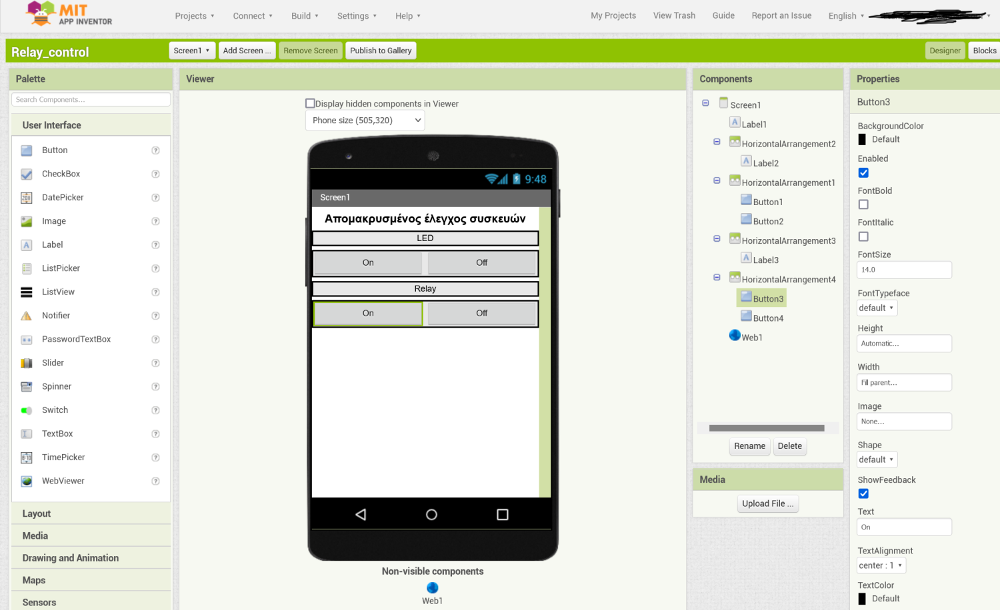

# Απομακρυσμένος έλεγχος συσκευών από το κινητό τηλέφωνο

Το project αφορά στον απομακρυσμένο έλεγχο ηλεκτρικών συσκευών με τη
χρήση κινητού τηλεφώνου. Πιο συγκεκριμένα, το project αποτελείται από
δύο τμήματα:

-   Το πρώτο τμήμα αποτελείται από έναν μικροελεγκτή πάνω στον οποίο
    έχουμε συνδέσει έναν ηλεκτρονόμο (Relay). Ο ηλεκτρονόμος είναι ένα
    εξάρτημα το οποίο μας δίνει τη δυνατότητα να ανοίξουμε ή να
    κλείσουμε μια συσκευή η οποία λειτουργεί με οικιακό ρεύμα 220V. Τον
    ηλεκτρονόμο τον ελέγχουμε με τον μικροελεγκτή μέσω κατάλληλου
    προγράμματος που αναπτύξαμε.

-   Το δεύτερο τμήμα είναι ένα πρόγραμμα που αναπτύξαμε στην πλατφόρμα
    MIT AppInventor και εγκαταστήσαμε σε κινητή συσκευή Android. Το
    πρόγραμμα μας δίνει τη δυνατότητα να ανοίγουμε ή να κλείνουμε μια
    ηλεκτρική συσκευή από οπουδήποτε στον κόσμο, αρκεί να έχουμε κάνει
    προώθηση της αντίστοιχης πόρτας στον δρομολογητή μας.

# Υλικό και λογισμικό που χρησιμοποιήθηκε

Τα υλικά που χρησιμοποιήσαμε για το project είναι τα παρακάτω:

-   [Wemos Lolin32](https://www.wemos.cc/en/latest/d32/d32.html)

-   [Relay
    module](https://elearn.ellak.gr/mod/book/view.php?id=4568&chapterid=2440)

-   LED

Τα λογισμικά που χρησιμοποιήσαμε για το project είναι τα παρακάτω:

-   Προγραμματισμός του Wemos Lolin32 με το [Arduino IDE](Arduino%20IDE)

-   Προγραμματισμός της εφαρμογής με το [MIT
    AppInventor](https://appinventor.mit.edu/)

# Περίοδος υλοποίησης

Το έργο υλοποιήθηκε κατά την διάρκεια του δεύτερου τετραμήνου του
σχολικού έτους 2021-2022.

# Μέλη της ομάδας

Τα μέλη της ομάδας ανήκουν στο ΕΠΑΛ Καστοριάς και είναι τα παρακάτω:

  -----------------------------------------------------------------------
  **Ονοματεπώνυμο**                   **Τάξη**
  ----------------------------------- -----------------------------------
                                      

                                      

                                      

                                      
  -----------------------------------------------------------------------

# Σχολική μονάδα

ΕΠΑΛ Καστοριάς

Εργατικές κατοικίες

52100, Καστοριά

Τηλέφωνο: 2467028206

Email:
[[mail@1epal-kastor.kas.sch.gr]{.underline}](https://github.com/ththemelis/epal-airquality/blob/main/mail@1epal-kastor.kas.sch.gr)
